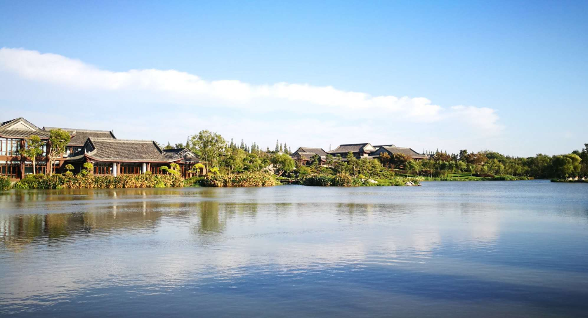

---
layout: post
title: 《寻美》笔记
date: 2020-04-23
Author: 阿翛
categories: 
tags: [摄影, 艺术]
comments: true
--- 

## 书评

​	所谓摄影中的东方美学，我觉得主要可以拆解为摄影主题和摄影构图两个方面。青简喜欢拍烟雨空蒙、夏荷冬雪、园林禅寺，这些本来就是中国传统美学的经典意象，以之为原料的摄影作品，自然浓浓国风。再厉害的摄影师在西欧的教堂里也拍不出东方意韵，毕竟巧妇难为无米之炊。确定了摄影主题，摄影者在构图中融入自己的审美和巧思，以求把原料风味发挥到极致。对于摄影构图中的中国风，青简在书中反复提到虚与实、藏与露的中国传统绘画理论。因为摄影与绘画本来就是强相关的，只是表现美的媒介不同罢了。

​	本书对摄影技巧的讲解有启发性，但比较简略，占据大量篇幅的抒情文字有点生硬造作，因此三星。多加一星给青简那些惊艳到我的美图。

## 书摘

### 烟雨空蒙

1. 整体与局部

   - “拍摄雨景，···，一般可以采用中长焦段，能兼顾远景与中景。远景多为山，雨中的山间一般都会有云雾，中景可以是河流或建筑，再加之冷色调、低饱和度，很适合营造青绿山水的画意。“
   - “如果只拍摄空中的雨滴，可以通过大光圈手动对焦，把焦点设置为较近的距离，虚化背景，这样总会有进入焦平面而被清晰拍到的雨丝。这种拍摄需要长焦镜头。“
2. 快门与慢门

   - “如何才能在静态的照片中表现出雨的动感，···，不同的快门速度能表现出不同的动态效果。较快的快门速度，拍摄出的雨，是“雨滴梧桐点点愁”的圆点或水滴状；而较慢的快门速度，拍摄出的效果就如“小雨丝丝梅子熟”的丝状或线状。”
3. 暗部与亮点

   - “雨水会反光，因此表现雨滴或雨丝，最好选择较暗的背景。雨天拍摄，一般多采取减少曝光的方法，即按正常曝光量减少一挡至一挡半，这样有助于提高画面的反差。”
   - “最佳的情况是在暗色中也有亮色来作为点睛之笔，如此才能使画面不会显得太沉闷。无论是涟漪中的锦鲤和落叶，还是窗前的一枝垂绿或室内的一盏孤灯，都是阴雨天中难能可贵的一抹亮色。”
4. 生机与人物

   - “适当地在照片中引入一些生机，如当季植物等，既可体现季节特征，又能营造气氛与意境。···，画面中有了人物，就有鲜活的气息。雨天人物活动比平时少，却往往更有意趣。”
5. 雨前与雨后
   - “山雨欲来，黑云压城的画面，···，拍摄这个题材时，可以用广角焦段，恰当减少曝光、压低影调，或者用HDR（一种后期合成技术），营造出一种沉闷、压抑的氛围。”
   - 地面上积水未消时，拍摄倒影。“也可将主体与其倒影一同呈现在画面之中，这样通常就需要采用较低的机位，可以借助相机的翻转屏，使相机尽可能靠近水面。”

### 春满人间

1. 春花，虚实结合
   - “长焦大光圈，···，把焦点对在背景上，虚化前景的花草，有时反而能制造出虚实结合的梦幻效果。”
   - 注意两点：“一是前景要色彩鲜亮，或是叶的颜色绿意明媚，或是花的本身嫩黄娇红；二是背景要简洁得当。
2. 春水，动静相宜
   - “若要表现水的动态，传统的技法是采取慢门长曝光，这对于激流跌宕的山涧可行，对于平静开阔的水面就无用了。所以对后者，窃以为可有意撷取一些相对运动的景物，来衬托静水流深。”
3. 春山：“拍摄山要学会等待，等一个云、雾、山、景结合得恰到好处的时刻”

### 夏荫涵碧

1. 避免正午：“夏季光线强、气温高，可以用较高的快门速度和较小的光圈，而不必担心焦点不实和景深不够，只要能拿稳相机就可以了。···，建议尽可能避开光线过强的中午，并使用更精细的测光方式，如点测光或分区测光方式。···，如果必须在正午拍摄，可以尝试黑白模式，强烈的阳光和阴影的对比在黑白模式下会形成一种独具视觉张力的画面。”
2. 注重层次：“一是在色彩上，虽然只有绿色，也可以选择有不同深浅、浓淡的景物；二是在构图上，要注意远近层次，通过不同的色彩差别与空间层次，来增添画面元素，使得绿色也丰盈活泼起来。”
3. 加入动态：“绿色总给人静谧平和的感觉，如果在绿色背景中加上一些动态景物，能避免画面过于沉闷。”
4. 丁达尔光：“选择正确的角度，找到光线质感最强的位置，选择较暗的场景拍摄，使用点测光，把测光点放在光线与景物接触的边缘。点测光会让背景压暗，使光束凸显出来，可以更加准确地把明暗部分清晰地区分开来。”

### 荷影湖光

1. 浓淡相宜：“晴天一般可以利用早晚光线最柔和的时刻，逆光拍摄，凸显出荷花的明媚之美。阴雨天适合拍摄的时间段更长，色温也可以调整到偏冷，把花叶与雨珠、雨丝结合，衬托出荷花的孤傲之姿。甚至在雾霾天也会有意外收获，利用水天迷茫的背景，虚实结合，营造一番飘渺之意，却是晴天所不及的。”
2. 动静结合：“鱼戏莲叶间”、“荷花香里棹舟回”
3. 建筑衬托
   - “建筑可以作为背景衬映，也可以作为前景画框，此时该怎样去构图，就看每个人的感觉，或者说看对美的理解了。”
   - “习惯了去寻找建筑，却在荷塘中的水榭边无意发现四周的荷花映在水榭的玻璃窗上，与室内的景物产生重叠，这样无须二次重曝，也不必后期合成，便能拍到如幻如真的独特视角。”
4. 后期制作：“各种多重曝光、油画效果、国画效果，网上已经有很多教程”

### 小园幽榭

1. 框与隔：“可以直接把门窗用作画框构图，使得拍摄主体直接呈现为画中景物，此即是框；也可以把它作为一种隔断，使得拍摄主体隐藏在其后，间接来表现，此即是隔。无论是框还是隔，是直接还是间接，都是试图用平面的照片去体现一种空间的深远感。”
2. 藏与露：用在摄影上，尤其在表现意境上，要注重藏，所谓“景露则境界小，景隐则境界大”。
3. 曲与直：“曲线可以是静态的，如檐角、门洞、石桥、游廊、幽径、山墙、甚至树木的枝干等；也可以是动态的，池中游鱼、檐上飞鸟，它们运动的痕迹也是一种优美的曲线。”
4. 虚与实：“在园林摄影中，除全景视角外，大多会使用到中长焦和大光圈，浅景深势必会造成虚化效果，无论是虚化前景，还是虚化背景，都可以在相对局限的园林中，营造一种纵深感。···，但需注意的是，一要选择适合的虚实对象，一般把实作为主体，虚作为陪衬；二是虚实要有所侧重，一个画面中，不能虚实平分秋色，应或以实为多，或以虚为多，但占据画面多的并不一定是主体。”

### 北国深秋

1. 巧用光影：“如果直接拍摄太阳，尽可能要在太阳半露时候，免得引起照片反差过大。此外，要体现光影，点测光配合逆光拍摄，效果尤佳。逆光下可以凸显出草木或者动物的轮廓，质感强烈，局部光影效果让人着迷。不过在这里需要提醒的是，除了测光点要选准，还要充分利用曝光补偿来平衡画面的亮度，宁欠勿曝，这样也给后期处理留下空间。”
2. 疏密结合：“密的时候要杂而不乱，无论色彩、形状都要体现一种协调感；疏的时候要有点睛之处，在简单的画面中能抓住观者的视线。”
3. 善用慢门
   - “风光摄影时，慢门常常被用来拍摄水流，采取低至1/2s或1s以上的快门速度，能拍摄出如丝似雾的水流效果。” 拍摄秋水可以结合秋天景物、秋天色彩。
   - “拍摄秋林时也不妨把快门刻意放慢（例如1/10s到1/20s），并有目的地移动相机，例如在拍摄时垂直移动相机，存心使得照片中树木模糊，可以得到更具艺术性的抽象效果。”

### 雪落江南

1. 设置参数：“首先是曝光控制，经常说白加黑减，是指在大面积白色的情况下，需要增加曝光补偿，让雪看上去更亮，也就更加洁白，不会显得灰蒙蒙。一般如果不是在旷野中，比如在城市园林里，增加1EV就足够了。至于白平衡，在拍摄雪景时，如果选择自动白平衡，通常都会得到较低的白平衡值。个人认为冷色蓝调可以让照片看上去愈加宁静清隽，因此没必要增加白平衡色温值。但是如果拍摄雪天的日出日落，便可选择较高色温值，让照片产生冷暖对比。在后期处理时，我一般还是习惯用较低饱和度与对比度，去表现寂静的世界本色。”
2. 注重构图：“由于雪景难有层次的特性，利用树木、花朵或建筑物等物体作为拍摄的前景，可以增加空间深度，提高雪景的表现力，使得整个画面的内涵更加丰富。也可以以建筑的门窗作为框架，这样就不至于因为雪天色彩单调而使观看者产生厌倦的情绪。”
3. 拍摄飞雪：“想要拍摄漫天的雪花，将空中的雪花凝固下来，最常见的方法就是使用较快的快门速度拍摄。一般雪不算很小的情况下，快门速度在1/500s以上就可以了。其次雪花的颜色是白色，用长焦镜头拍摄会显得更清楚。另外在逆光环境下，更能凸显雪花漫天纷飞的效果。如果要进一步以飞雪为主题，可以用长焦镜头对焦在飞雪上，把其余景物虚化，但是被虚化的背景也要选择得当，既不能太过杂乱，也不能过于简单，且以深色为上，有时候古建“筑的局部，比如门、檐、窗都是较好的背景”

### 问禅不语

1. 化繁为简：“在简洁的背景中，一个醒目或是具有吸引力的主体会很容易吸引观众的视线。···，任何会干扰表现意象的元素，都不允许进入镜头”
2. 色彩淡雅：“以较低饱和度的淡雅色彩去呈现人生的素简，因此在色彩与构图上，我们都可以尝试做一些减法。” 

