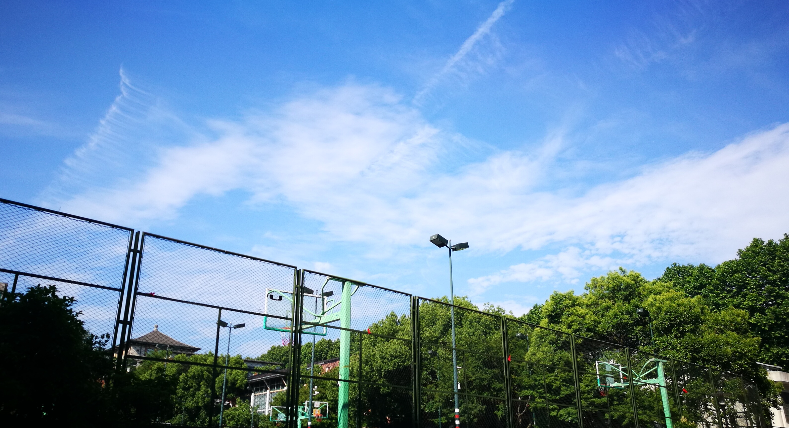

​&emsp;&emsp; 		我与hs相识于2017年春季。当时我刚刚通过浙大计院研究生复试，正为了找导师焦头烂额，而每次点进年级QQ群，都能看到很多同学在向此君致敬，那种刷屏的“hs🐂🍺”的场面是从小语种专业过来的我前所未见的。震惊之余，我怀着紧张的心情加了hs的好友，想向他求得一些经验。他很快通过了。从此，正道的光照在了我前行的道路上。

​&emsp;&emsp; 		hs和我一样是跨考生，不过他本科读的是航天专业，数理基础非常扎实。谈及本科阶段的学习，hs说有两点对他帮助很大，一是广泛的阅读，除了专业书，心理学、文学、经济学方面的书他也看，主要是国外的经典教材。二是网络公开课，比如MIT的OCW，在国内大学的同行衬托下，网络公开课更显得是个宝库。在读研前，hs已经完成了上百本书的阅读和几十门网络公开课的学习。直到现在参加工作了，他也仍会在休息时间寻找和参加高质量的公开课，我钦佩地称他为OCW掘金者。

​&emsp;&emsp; 		熟识之后，我跟hs亦师亦友，他比我的导师更像我的导师。就像孔子经常喷子路一样，hs也经常唾骂我的愚钝和不思进取，印象深刻的有两次。

​&emsp;&emsp; 		我在研究生阶段的主要学习方向是机器学习，然而学起来总感觉隔靴搔痒，一个算法看了几遍也不觉得自己完全掌握，当时觉得懂了过了两天又把细节忘了。吴恩达是我的第一个ML老师，我先后上了他在Coursera上的公开课和在斯坦福开设的CS229课程。 虽然也选修了浙大蔡登老师的ML课，但我还是抱着CS229的讲义看。现在回想起来，与其说我喜欢CS229的讲义，不如说我陷入了一种不知如何学习的窘境。hs对我这种抓着一个讲义疯狂刷的学习方式非常不屑，他说：“可能由于你之前是文科生，对知识的学习主要是靠记背，这是一种passive learning，而不是active learning，换句话说你缺少批判性思维，对于书或者论文里的做法和观点，你不应该只是记忆，而是不断地去问为什么，探究背后的motivation。万物皆motivation。”我唯唯称是。

​&emsp;&emsp; 		第二次是研二下找实习，我面一家挂一家，十分丧气。而hs那时已经横扫大厂，连最难的Google也收入囊中。他看我一蹶不振的样子，又开始了技术扶贫，跟我进行了一次mock interview。hs按着我的简历问了我做的项目和ML的基础知识：“你用过MTCNN是吧，你说说为什么需要landmark，你不知道？这在论文里是有写的。那我问你点ML的知识吧。LR知道吧，有什么优缺点？······，GBDT呢？DL呢？”整个过程我回答得稀烂。最后他总结道：“我直说了，你的表现没有一丝优点，如果我是面试官，我肯定不会要你，团队不需要你这样的。”我毫无防备地流下了属于真正弱者的眼泪。不过喷归喷，hs给了我很多细致的面试建议，比如要非常熟悉自己做的项目、要知道各个ML模型的假设、优劣和适应场景、跟面试官交流时要自信，等等。不得不说，hs给我的建议是一针见血的，之后的面试渐渐变得顺利，我也在找实习和秋招中都拿到了大厂的offer。

​&emsp;&emsp; 		孔子曾欲无言，吓坏了子贡。我比孔门子弟幸运，从来不用担心hs会停止说话。hs说，故hs存在。我们的另一个朋友李神曾发现，无论他在哪个微信群，最后都是在跟hs聊天。hs的大量输出一方面是因为他输入的多、对信息的消化和代谢快，另一方面是因为他有一种普度学渣的博爱精神。hs对来向他提问的同学总是知无不言、言无不尽，浙大计院流传着一句他的名言：“我是hs，有什么不懂可以来问我”。hs擅长反思总结，而且在跟他人分享学习经验、学习材料时，毫不藏私。为了让更多人受益于自己的经验，hs今年搭建了个人博客，内容也在知乎上同步更新，一时间好评如潮、学渣相庆。

​&emsp;&emsp; 		我觉得hs之所以这么强，很大原因是他对于学习有种超人的专注，我一度怀疑他不是在学习，就是在谈论学习。这里的学习是广义的，指对于自己任何方面的提升。hs推崇勤奋和坚持：“很多事情对我来说，就是坚持，然后取得胜利。”hs在我心中已然成为一个图腾，一个不断提升自我的图腾。我基本是个好吃懒做的人，但心中也残留着一丝对进步的渴求，在玩得不知道自己是谁的时候，我就会开始想念学习，这时候就会想起hs，心中涌现乡愁一般的情绪。花花世界迷人眼，我在娱乐至死的焦虑和恐惧中想起hs，就像流亡四海的犹太人回忆起耶路撒冷。关掉b站，退出微博，CSAPP不香吗，我仿佛听到hs的召唤。

​&emsp;&emsp; 		像许多理工男一样，hs在生活上随意而节能。第一次见到他本人是在玉泉，他身材修长，穿着黑衣黑裤黑鞋，由于暑假练车，皮肤也晒得黑黑的，整个人像一只大知了。那时候是夏季，阳光和风都带着蝉鸣，他穿成这样倒也应景。我就跟这只大知了在校园里瞎逛，他说些冷笑话把自己逗笑，笑起来眼睛眯成一条缝。几个月后再见到他时，他刚刚脱单，白了很多，浑身散发着爱情滋润下的满足和嘚瑟。我暗道，高端玩家，🐂🍺🐂🍺，换了皮肤，还有妹子。但即使有了妹子，我还是敏锐地发现他的秋衣没塞好，露了一大截在外头。

​&emsp;&emsp; 		hs的一绝是喜欢在节假日吃泡面，有时候加火腿肠加蛋。春节期间大家都会在微信群里晒自家的美食，看得人食指大动，啧啧感叹人民终于奔小康了。hs一晒照则如当头棒喝，让人想起我国仍然处于社会主义初级阶段。大家打算众筹给hs点个外卖，但hs拒绝了，他说吃泡面只是因为家人出门办事，自己一个人懒得折腾。这应该是真的，因为后来有次毕至居聚会，hs做了几个菜还是挺好吃的。

​&emsp;&emsp; 		跟hs认识的三年倏然已过，我们选择了毕业后去不同的城市的工作，以后可能是“相见时难别亦难”了，不过也问题不大，SNS若比邻。hs去了一家压力很大的外企做开发，时不时说自己顶不住了，要跳槽。感情上，hs又回到了单身的状态，并成为了CC98缘分天空版块的密切关注者。偶尔也会听他语意缱绻地谈起他觉得不错的女孩子，但到底没有新闻。我不禁感慨，即使强如hs，在这人世间也是寻寻觅觅，谋生亦谋爱啊。

