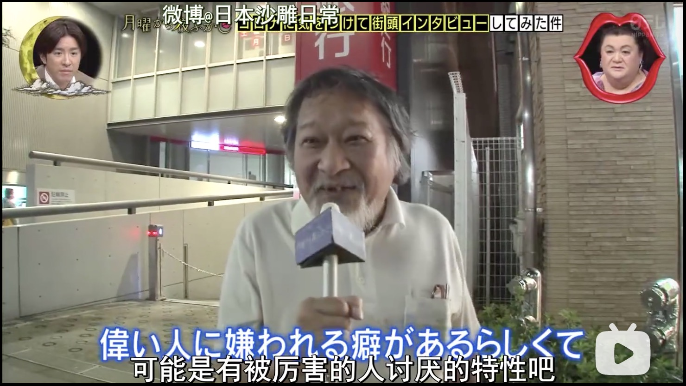

&emsp;&emsp; 		看月曜201103期，其中一位受访者是个老爷爷，牙齿已经掉得稀稀落落，他说自己没钱补牙，stuff问他牙齿没了有什么烦恼吗，他笑嘻嘻地回答说是发不出英语的“th”这个音。那有什么话（由于没牙了）比较难说吗？老爷爷理解错了问题，回答说向别人借钱的话很难说出口。看得出来他过得很不好，身上的衣服已经很久没换了，脏兮兮的。他说他总是做不好工作，被炒鱿鱼。上一份工作是保安，也被炒了。彼时已经是大晚上了，他还在外面晃悠，不知道有没有住的地方。

&emsp;&emsp; 		人间不公平，每个人生来所享受的资源就不一样，有些人就是家里穷，长得不好看，父母不会教育，人也糊涂不聪明，一手烂牌。年轻的时候还能仗着健康的身体，靠出卖力气来维持表面上的得体，青春逝去之后则屡屡被公司嫌弃，挥之则去，他想不明白自己做得哪里不对，只能感慨自己是“駄目な人”。我深为这个老爷爷的晚年感到忧虑，我觉得他可能没有家人能照顾他，而他的经济条件会让他很难捱过一次大病，最后大概率在都市某个脏乱的角落里孤独地死去。但接受采访的全程，老爷爷都是笑眯眯的，即使是勉力而为，还是让我很受感动。“年轻漂亮的男孩女孩，在舞台上唱唱跳跳，说要给粉丝勇气，他们这算什么勇气呢？”一无所有还微笑着艰难求生的人才能给人勇气吧？

&emsp;&emsp; 		我一直觉得在理想的社会里，鳏寡孤独废疾者皆有所养，每个人都能有尊严地活着。但目前大多数国家的社会保障体系下，弱势群体的生活如蝼蚁一般窘迫。B站上有一大堆个人进行社会救助的视频，直接把最贫困的人的生活扔到我们眼前。每次看到这种视频，我总敬佩救助者的侠义，同时也忧愁，世界上有这么多需要救助的人，而且对一个人的救助不是一次两次就能解决的，这需要几年甚至几十年的人力物力的投入，哪个个人可以承担这么大的开销？

&emsp;&emsp; 		当然我的忧愁和我的“哀民生之多艰”都是廉价的，我除了在这里写自己的感想之外，不能为那个老爷爷做任何事情。还不如月曜那种游戏人间一般的态度，对穷人富人一并调侃，无法改变那就找点乐子。可是我对调侃穷人/弱者的桥段真的笑不出来，一点都笑不出来，我只觉得难堪、想哭。我总是容易和弱势的一方产生太强的共情，然而这样的共情没有任何价值，因为转头我就要开始为明天的组会烦恼，为杭州的房价心焦，任由生活的细碎与世俗的欲望覆盖我的共情。

&emsp;&emsp; 		但应该是无法完全覆盖的，the compassion lurks there。希望以后自己能够为老爷爷们出一份力吧（立一个小小的flag）。

